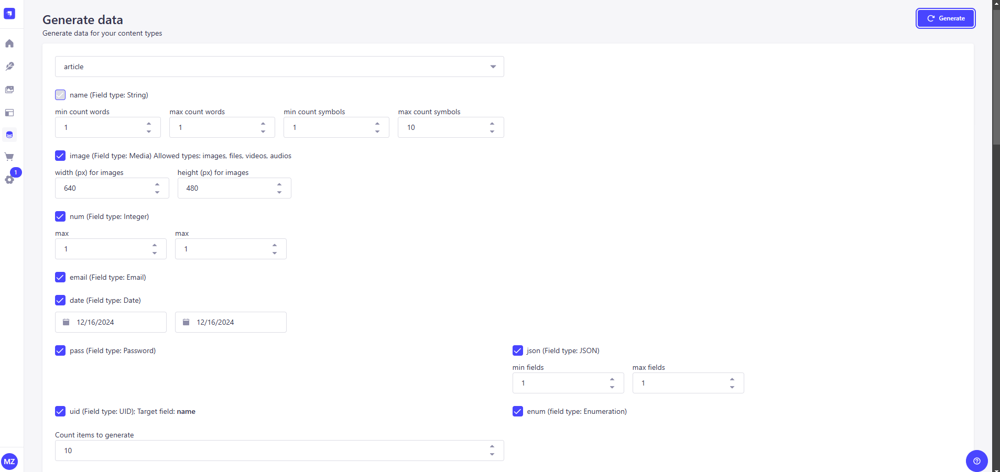
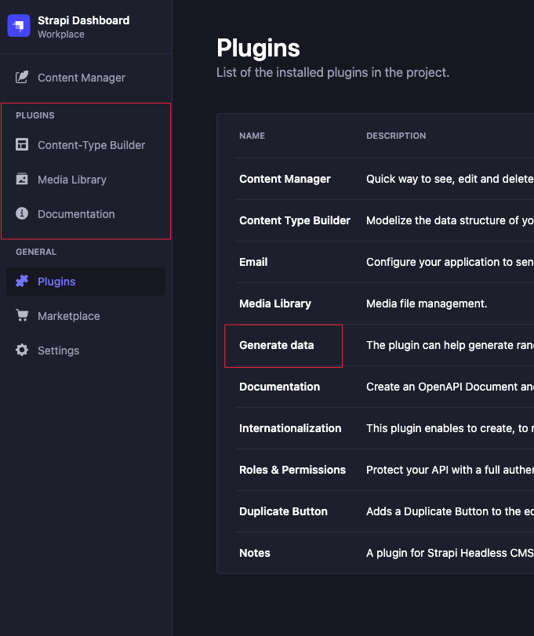

# Strapi plugin generate-data

This plugin is for generating data for your content-types for strapi v4 and v5.
`For strapi version v4 use plugin version 1`
`For strapi version v5 use plugin version 2`



# Features

-   It supports only `string` with RegExp pattern, `email`, `richtext`, `integer`, `decimal`, `date`, `media(videos, images, audios, files)`, `boolean` `enumeration`, `password`, `UID`, `relation`, `json` fields of your content types, including Strapi users.
-   **Boolean fields**: Control boolean value generation with three options:
    -   **Random**: Generates random boolean values (default)
    -   **True**: Always generates `true`
    -   **False**: Always generates `false`
-   Ability to publish data if you have draft mode for your type
-   Ability of choosing which field should be included in generating data
-   It has preview of data in table, which you want to upload
-   Ability of flushing data of the content type you want to upload the generated data
-   It creates content in draft if the content type has draft & publish option

# Installations

To install this plugin, you need to add an NPM dependency to your Strapi application:

```
# Using Yarn
yarn add strapi-plugin-generate-data

# Or using NPM
npm install strapi-plugin-generate-data

```

It should be activated by default, but if you don't have it in your admin then enable the plugin manually in config/plugins

```
{
    ...,
    "generate-data": {
        enabled: true,
    },
}
```

# Possible issues

1. If you don't see generated images on ui and see in console error like **content security policy** for each image url then you need to update middleware **strapi::security** in config/middlewares like

```
...,
 {
    name: "strapi::security",
    config: {
      contentSecurityPolicy: {
        useDefaults: true,
        directives: {
          "connect-src": ["'self'", "https:"],
          "img-src": ["'self'", "data:", "blob:", `https://loremflickr.com/`],
          upgradeInsecureRequests: null,
        },
      },
    },
  },
...
```

2. If you have issue with upload data locally try to use **127.0.0.1** instead of **localhost**
3. If you have issue with no **Generate data** plugin in left panel, try to run **strapi build** command it will build your app with plugins

-   

# Environment

-   Strapi

# Future plans

-   Custom fields
-   Dynamic zones
-   Components
