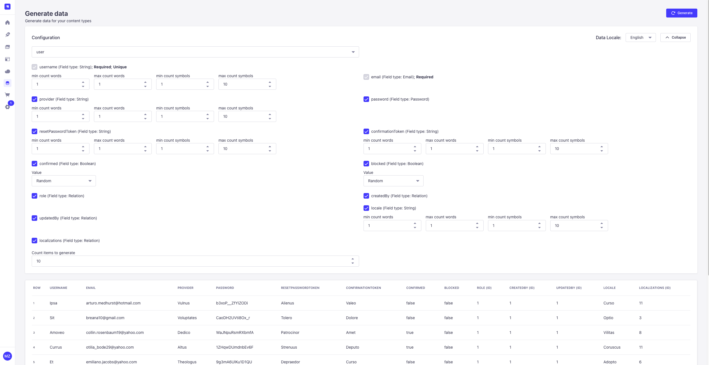

# Strapi plugin generate-data

This plugin is for generating data for your content-types for strapi v4 and v5.
`For strapi version v4 use plugin version 1`
`For strapi version v5 use plugin version 2`



# Features

-   **Supported field types**: Generates fake data for the following field types:
    -   `string` (including RegExp patterns)
    -   `email`
    -   `richtext`
    -   `integer`
    -   `decimal`
    -   `date`
    -   `media` (videos, images, audios, files)
    -   `boolean`
    -   `enumeration`
    -   `password`
    -   `UID`
    -   `relation`
    -   `json`
    -   Works with all content types, including Strapi users
-   **Locale support**: Generate localized fake data by selecting from multiple supported locales (English, German, Russian, French, Japanese, Korean, Arabic, Polish, Dutch, Turkish). The locale selector is available in the Configuration section.
-   **Boolean fields**: Control boolean value generation with three options:
    -   **Random**: Generates random boolean values (default)
    -   **True**: Always generates `true`
    -   **False**: Always generates `false`
-   **Field selection**: Choose which fields to include when generating data
-   **Data preview**: Preview generated data in a table before uploading
-   **Draft & publish**:
    -   Creates content in draft mode if the content type supports draft & publish
    -   Option to publish data directly if draft mode is enabled
-   **Data management**: Flush existing data from a content type before uploading new generated data

# Installations

To install this plugin, you need to add an NPM dependency to your Strapi application:

```
# Using Yarn
yarn add strapi-plugin-generate-data

# Or using NPM
npm install strapi-plugin-generate-data

```

It should be activated by default, but if you don't have it in your admin then enable the plugin manually in config/plugins

```
{
    ...,
    "generate-data": {
        enabled: true,
    },
}
```

# Possible issues

1. If you don't see generated images on ui and see in console error like **content security policy** for each image url then you need to update middleware **strapi::security** in config/middlewares like

```
...,
 {
    name: "strapi::security",
    config: {
      contentSecurityPolicy: {
        useDefaults: true,
        directives: {
          "connect-src": ["'self'", "https:"],
          "img-src": ["'self'", "data:", "blob:", `https://loremflickr.com/`],
          upgradeInsecureRequests: null,
        },
      },
    },
  },
...
```

2. If you have issue with upload data locally try to use **127.0.0.1** instead of **localhost**
3. If you have issue with no **Generate data** plugin in left panel, try to run **strapi build** command it will build your app with plugins

-   

# Environment

-   Strapi

# Future plans

-   Custom fields
-   Dynamic zones
-   Components
-   Better date controls: Calendar picker, relative dates ("last 30 days")
-   Copy/paste generated data
-   Statistics: Show data distribution, unique values count, etc.
-   Inline cell editing
-   Recent activity: "last generated 50 articles, 50 minutes ago"
-   Regenerate only specific field field
